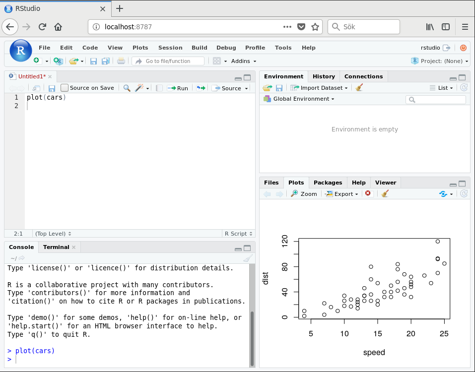

==========================
RStudio server environment
==========================

Description
===========

Starts an rstudio server environment using docker and
docker compose on port 8787.

Reference:

https://hub.docker.com/r/rocker/rstudio/

How to use
==========

Edit the 'volumes' section of docker-compose.yaml to map
to a directory that you want to store your data.

Build and start it::

  sudo make build
  sudo make up

Start a browser on: http://localhost:8787 and login using
'rstudio' as username and 'kaka' as password.

Installed packages
==================

* RMySQL
* Rmd to pdf packages to build reports.
* tidyverse
